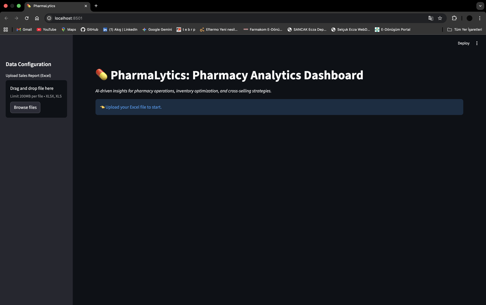
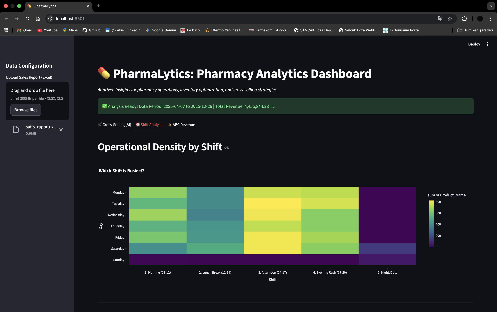
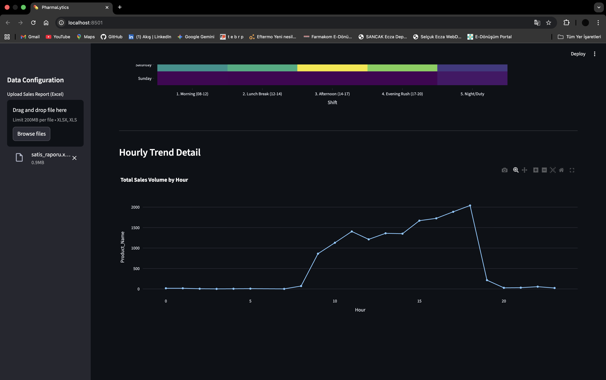

# 💊 PharmaLytics: AI-Driven Pharmacy Analytics Dashboard



## 📖 Project Overview
**PharmaLytics** is a data science project designed to bridge the gap between **Retail Pharmacy Operations** and **Artificial Intelligence**. 

As a **Pharmacist and Software Developer**, I identified that many pharmacies struggle with inventory management and missed cross-selling opportunities due to a lack of data utilization. This tool transforms raw transactional data (Excel) into actionable strategic insights using Python.

### 🎯 Key Goals
* **Maximize Revenue:** By identifying cross-selling opportunities (Market Basket Analysis).
* **Optimize Operations:** By visualizing peak hours for better staff scheduling.
* **Inventory Control:** By classifying products based on their revenue impact (ABC Analysis).

---

## 📸 Dashboard Preview

Here is the comprehensive view of the analytics dashboard:

<p align="center">
  
   
</p>

---

## 🚀 Key Features

### 1. Cross-Selling Recommendations (AI-Powered)
Uses the **Apriori Algorithm** to discover hidden relationships between products.
* **Logic:** "If a customer buys *Product A*, they are X% likely to buy *Product B*."
* **Use Case:** Helps pharmacists recommend complementary products.


### 2. Top Revenue Products (ABC Analysis)
Classifies products based on their contribution to total revenue (Pareto Principle).
* **Class A:** Top 80% of revenue (Critical Inventory).
* **Class C:** Low impact items.


---

## 🛠️ Tech Stack

| Component | Technology | Description |
| :--- | :--- | :--- |
| **Language** |  | Core logic and scripting. |
| **Frontend** |  | Interactive web interface. |
| **Data Manipulation** | **Pandas** | ETL processes, cleaning, and time-series handling. |
| **Machine Learning** | **MLxtend** | Implementation of Apriori and Association Rules. |
| **Visualization** | **Plotly Express** | Interactive charts and heatmaps. |

---

## 🚀 How to Run Locally

1. **Clone the Repository**
   ```bash
   git clone [https://github.com/YOUR_USERNAME/pharmalytics.git](https://github.com/YOUR_USERNAME/pharmalytics.git)
   cd pharmalytics